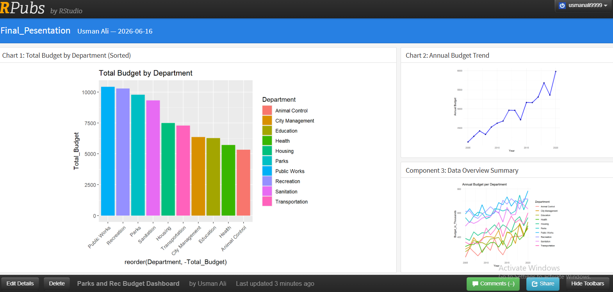

# Parks & Recreation Budget Analytics Dashboard 📊📈

An interactive, web-based data dashboard built entirely in **R** to analyze and present organizational budget distributions and annual spending trends from 2005 to 2020+. 

🔗 **[Click here to view the live dashboard on RPubs!](https://rpubs.com/usmanali9999/1442639)**

---
---

## 🖥️ Dashboard Preview


---

## 📌 Project Overview
This project transforms raw financial data into a decision-making tool. Using an R Markdown workflow with `flexdashboard`, it presents a multi-component view of operational costs to identify funding priorities, macro budget trajectories, and granular department growth.

---

## 📊 Key Data Insights & Metrics

Based on the dashboard analysis of the dataset, several critical financial patterns emerge:

### 1. Departmental Allocations (Chart 1)
* **Top Funded Departments:** **Public Works**, **Recreation**, and **Parks** command the highest overall funding, with Public Works leading the organization at over **10,000 (Thousands)** in total budget.
* **Lowest Funded Departments:** **Animal Control** sits at the bottom of the cumulative budget spectrum at approximately **5,000 (Thousands)**, followed closely by **Health** and **Education**.

### 2. Macro Budgetary Growth (Chart 2)
* **Consistent Upward Trajectory:** The overall organizational annual budget has experienced steady, significant growth over a 15+ year timeline.
* **Scale of Expansion:** Total funding scaled from roughly **3,500 (Thousands) in 2005** to a peak of nearly **6,000 (Thousands) by 2020**.
* **Volatility:** The macro-trend shows brief periods of minor spending contraction (notably around 2012 and 2018) before making sharp recoveries to historic highs.

### 3. Granular Trajectories (Component 3)
* **High-Volatility Sector:** The top tier of funded departments (represented by the blue/pink line clusters) displays intense fluctuation year-over-year, indicating dynamic shifting of seasonal or project-based funding.
* **Steady Climbers:** Mid-tier and lower-tier departments (like City Management and Education) maintain tight, less volatile corridors while keeping pace with steady baseline inflation.

---

## 🛠️ Tech Stack & Libraries
* **Language:** R
* **Environment:** RStudio
* **Data Manipulation:** `dplyr`
* **Data Visualization:** `ggplot2`
* **Dashboard Framework:** `flexdashboard`

---

## 📁 Repository Structure
* `Presentation_Final.Rmd`: The main R Markdown source code file containing data processing scripts and layout architecture.
* `parks_and_rec_budget.csv`: The primary dataset containing historic spending metrics across multiple departments.
* `README.md`: Project description and deployment details.

---

## 🚀 How to Run Locally
To explore the source code or adapt it to your own dataset, replicate the setup steps below:

1. Clone or download this repository.
2. Open **RStudio** and make sure you have the required packages installed:
   ```R
   install.packages(c("dplyr", "ggplot2", "flexdashboard"))
   ```
3. Update the file path in the `read.csv()` line inside the script to match your local computer directory.
4. Click the **Knit** button in RStudio to generate the local HTML interactive dashboard!


